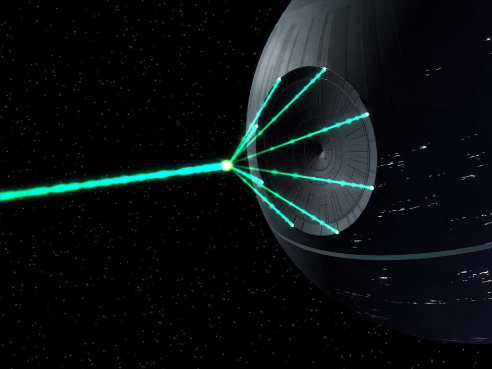

# CatOmator

Automated laser turret cat toy

> DISCLAIMER: Due to the lack of real-life pictures at hand, I took some liberties with the choice of visual depiction.

## BOM

| Item                             | Amount |
| -------------------------------- | ------ |
| Wemos D1 Mini (ESP8266)          | 1      |
| Laser module 650nm 5mW           | 1      |
| SG90 9g micro servo              | 2      |
| TODO: Laser driver circuit parts |        |
| TODO: Screws, bolts              |        |

## Assembly

See photos in [Super Ultra Compact Pan/Tilt Camera Mount - V2](https://www.thingiverse.com/thing:1799905).

## Compilation and uploading

Populate [`secrets.yaml`](./secrets.yaml) with your secrets before compiling.

See ESPHome's [getting started guide](https://esphome.io/guides/getting_started_command_line) to learn how to compile and upload this project to your ESP8266 module.

## Attributions

- Based on [The CatOmater on Printables.com](https://www.printables.com/model/579611-the-catomater-v-18-a-cat-automater-maybe-ceilingwa).
- [Super Ultra Compact Pan/Tilt Camera Mount - V2](https://www.thingiverse.com/thing:1799905)
